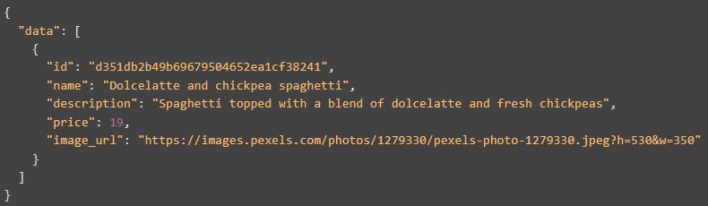

# Project GrubDash (Back-end)

## Express Javascript for handling back-end requests for dishes and orders on Project GrubDash

*Note: Order and Dish data is currently only stored in memory, so will revert to original data when server is restarted.*

## Available Requests

### /dishes

- GET: Returns all dishes
- POST: Creates new dish and stores in memory after validating request includes:
    - name
    - description
    - image url
    - valid price (integer greater than 0)

### /dishes/:dishId

- GET: Returns dish with matching ID
- PUT: Updates existing dish upon validating the following:
    - the dish exists in memory
    - request includes same details as for POST request
    - id (if included in request) matches id stored in data

Example dish structure:

### /orders

- GET: Returns all orders
- POST: Creates new order and stores in memory after validating request includes:
    - deliverTo
    - mobileNumber
    - dishes (non-empty array)
    - each dish in dishes array includes a valid quantity (integer greater than 0)

### /orders/:orderId

- GET: Returns order with matching ID
- PUT: Updates existing order upon validating the following:
    - the order exists in memory
    - current order status is NOT delivered
    - request includes same details as for POST request
    - request includes valid status property (pending, preparing, out-for-delivery, delivered)
    - id (if included in request) matches id stored in data
- DELETE: Removes order from stored data ONLY if current status is pending

Example order structure:

